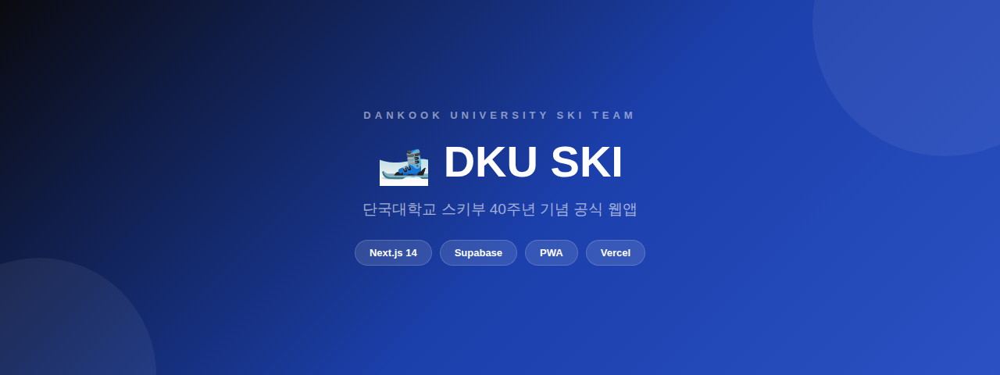

  

### 단국대학교 스키부 40주년 기념 공식 웹앱

**[🔗 바로 써보기 →](https://dku-ski.vercel.app)**

---

## 📌 소개

**DKU SKI**는 단국대학교 스키부 부원들이 합숙 및 행사 신청부터 회비 정산, 공지 확인까지
모든 동아리 운영을 한 곳에서 처리할 수 있도록 만든 모바일 우선(Mobile-first) PWA입니다.

40주년을 기념해 기획, 개발한 자체 서비스입니다.

## ✨ 핵심 기능

| 기능 | 설명 |
|---|---|
| 🔐 **간편 로그인** | 카카오 OAuth + 이메일 회원가입, 운영진 승인제 |
| 🏔️ **합숙 신청** | 달력에서 탭 두 번으로 날짜 선택, 실시간 참여 현황 확인 |
| 📢 **공지사항** | 읽음 처리, 상단 고정, 파일 첨부 |
| 🎉 **행사 관리** | 정기 훈련 · 당일 행사 · OB 초청 일정 관리 |
| 💰 **정산 시스템** | 1/N 자동 분배, 토스 간편송금 연동, 실시간 납부 현황 |
| 🔔 **푸시 알림** | Web Push API 기반 — 정산 요청 · 송금 확인 · 공지 알림 |
| 👥 **동문 디렉토리** | 기수 · 재학생/OB 필터 검색 |
| 💬 **커뮤니티** | 채널별 권한 분리(자유/재학생/OB), 익명 게시 |
| 🚨 **비상연락** | 패트롤 · 주장 · 훈련팀장 원터치 연결 |
| 📊 **재무 공시** | 시즌별 수입/지출 투명 공개 |

## 🛠️ 기술 스택
Frontend   Next.js 14 (App Router) · TypeScript · Tailwind CSS

Backend    Supabase (PostgreSQL · Auth · Realtime · RLS)

Infra      Vercel · Web Push (VAPID)

<b>아키텍처</b>

 

- **인증/권한**: Supabase Auth + Row Level Security. 관리자 전용 작업(권한 변경, 정산 생성/삭제)은 서버 API 경유 + 서버 측 역할 재검증으로 이중 보호.
- **정산 무결성**: 정산 생성은 `settlements` + `settlement_items`를 트랜잭션처럼 처리 — 항목 생성 실패 시 자동 롤백.
- **실시간 동기화**: Supabase Realtime으로 정산 상태 변경이 새로고침 없이 즉시 반영.
- **PWA 푸시**: Service Worker + Web Push API. iOS Safari의 silent-push 구독 취소 이슈를 방어하는 fallback 로직 포함.

## 📚 문서

| 문서 | 대상 |
|---|---|
| [운영진 관리 가이드](ADMIN_GUIDE.md) | 운영진 |
| 회원용 이용 가이드 (PDF) | 일반 부원 — 가입 시 배포 |

## 🤝 기여

이 프로젝트는 단국대학교 스키부 내부 운영용으로 개발되었습니다.
버그 제보나 개선 제안은 Issues 탭을 이용해주세요.

---

  Built with ❄️ by DKU SKI Shin Jeong Woo · 2026

